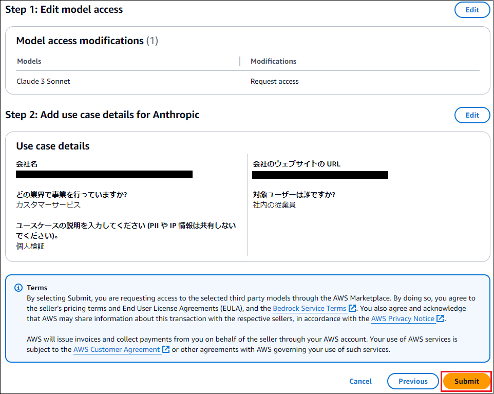
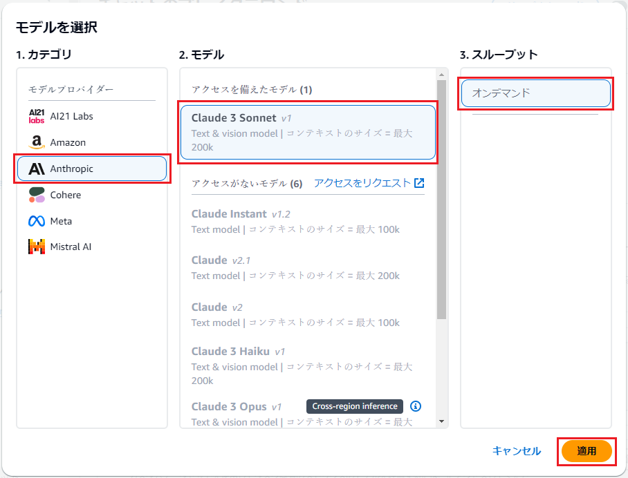
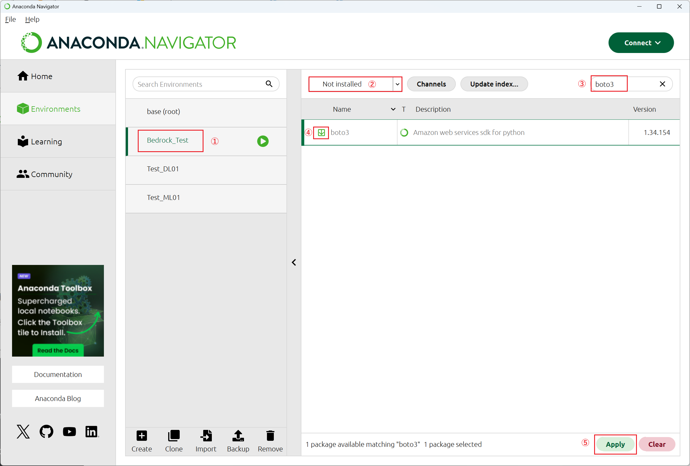
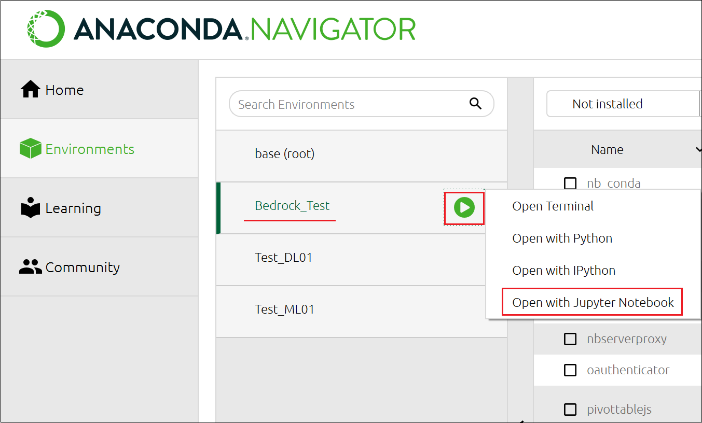

### 2024/10/13  

## ■目的
・書籍「Amazon Bedrock生成AIアプリ開発入門」の内容を、Cloud 9を使用せずに行う(ローカルのAnacondaで実行)  
・Amazon Bedrockを試してみる  
・モデル有効化方法の確認  
・プレイグラウンドを使用し、確認する  
・ローカル環境でBedrockにAPI実行して動作確認する  

---

## １．モデルを有効化する
・今回は試しにClaude 3 Sonnetを有効化する  
・会社情報などの入力が必要

---

(1)Amazon Bedrockコンソールを開く  
※すべてのモデルを利用できる**バージニア北部**リージョンにする  

---

(2)メニューの「モデルアクセス」をクリックする  
  

---

(3)「Enable specific models」をクリックする  
  

---

(4)Anthropicの「Claude 3 Sonnet」に☑を入れ、「Next」をクリックする  
  
  

---

(5)自身の所属会社情報や用途などを入力し、「Next」をクリックする  
  

---

(6)内容を確認し、「Submit」をクリックする  
  

---

(7)「Claude 3 Sonnet」のアクセスのステータスが「アクセスが付与されました」になることを確認する  
  

---

## ２．プレイグラウンドでお試し

### ２－１．プレイグラウンドでClaude 3 Sonnetを使用

(1)プレイグラウンドの「チャット」をクリックする  
  

---

(2)「モデルを選択」画面で以下を指定し、「適用」をクリックする  
・1.カテゴリ：`Anthropic`  
・2.モデル：`Claude3 Sonnet`  
・3.スループット：`オンデマンド`  

  

---

**各種パラメータの指定**  
以下をクリックする  
  

  
  

・温度：0～1で指定(0.1単位)。大きいほどランダム性が高い回答になる  
・トップP：0～1で指定(0.001単位)。回答で使うトークンのサンプリング範囲を使うパーセンテージで指定  
・トップK：0～500で指定。回答で使うトークンのサンプリングする個数を制限する  
・長さ：  
・停止シーケンス：  
・ガードレール：別途作成したガードレール設定をここで指定する？  

---

**比較モード**  
「比較モード」を有効にし、「モデルを選択」で別のモデルを選択する  
※比較対象のモデルは、事前に有効化しておく  

  

---

## ３．AWS SDKでAPIリクエストを行う

### ３－０．アクセスキーを使用するためにIAMユーザーを作成

(1)以下でIAMユーザーを作成する  
・ユーザー名：`Bedrock-user`  
・許可ポリシー：`AmazonBedrockFullAccess`  
・

---

(2)作成したユーザーの「セキュリティ認証情報」タブをクリックし、「アクセスキーを作成」をクリックする  
  

---

(3)以下を指定し、「次へ」をクリックする  
・ユースケース：`コマンドラインインターフェイス(CLI)`  
・確認：`☑上記のレコメンデーションを理解し、アクセスキーを作成する`  

  
  

---

(4)「説明タグ」は指定せずに「アクセスキーを作成」をクリックする  
  

---

(5)「アクセスキー」と「シークレットアクセスキー」をメモし、「完了」をクリックする  
  

---

### ３－１．ローカルPCのAnacondaで実行環境構築
・Anaconda上でBedrock用の環境「Bedrock_Test」を作成する  
・作成したBedrock_Testに「boto3」と「AWS CLI」をインストールする  
・作成したBedrock_Testに、Bedrockを使用できる権限を付与したAWSアクセスキーとシークレットアクセスキーを設定する  

※Anacondaのインストールは、AWSリポジトリ内の - 機械学習 - 0.環境準備(WindowsにAnacondaとPythonインストール).md を参照  

---

(1)ローカルPCでAnacondaを起動する  

---

(2)「Environment」の「Create」をクリックする  
  

---

(3)以下を指定し、「Create」をクリックする  
・Name：`Bedrock_Test`  
・Python：☑  

  

---

(4)「Home」をクリックし、「Bedrock_Test」を選択し、「Jupyter Notebook」の「Install」をクリックする  
  

---

(5)Jupyter Notebookが「Launch」になることを確認する  
  

---

(6)「Environment」の「Bedrock_Test」をクリックし、以下を指定して「Apply」をクリックする  
・②：Not installedを選択  
・③：「boto3」を検索する  
・④：「boto3」にチェックを入れる  

  

---

(7)「Install Packages」を確認し、「Apply」をクリックする  
  

---

(8)Bedrock_Testの「▶」をクリックし、「Open Terminal」をクリックする  
  

---

(9)コマンドプロンプトが起動したら以下を実行する  
```
conda install -c conda-forge awscli
```

---

(10)Proceed ([y]/n)で「y」を入力してEnterキーを押下する  
  

---

(11)アクセスキーとシークレットアクセスキーを設定する  
```
aws configure
```
・AWS Access Key ID：メモしたアクセスキーを入力  
・AWS Secret Access Key：メモしたシークレットアクセスキーを入力  
・Default region name：`us-east-1`  
・Default output format：`json` ※デフォルトはjson  

  

---

(6)「Environment」で「Bedrock_Test」の ▶ をクリックし、「Open with JupyterNotebook」をクリックする  
  

---

(7)AnacondaからのBedrock API確認。以下を実行する  
※現在のリージョンで利用で可能なモデルの一覧をJSON形式で出力する  
```
import boto3
```
```
import json
```
```
bedrock = boto3.client("bedrock")
```
```
result = bedrock.list_foundation_models()
```
```
print(result)
```

---

### ３－３．テキスト生成の確認

**■テキスト生成の確認**  
※「Bedrockってどういう意味？」の質問応答を表示するコード  
・今回は推論を行うために「`bedrock-runtime API`」を使う  

Jupyter Notebookに以下入力して実行する  
```
# Python外部ライブラリをインポート
import json
import boto3

# Bedrockクライアントを作成
bedrock_runtime = boto3.client("bedrock-runtime")

# リクエストボディを定義
body = json.dumps(
    {
        "anthropic_version": "bedrock-2023-05-31",
        "max_tokens": 1000,
        "messages": [
            {
                "role": "user",
                "content": "Bedrockってどういう意味？",
            }
        ],
    }
)

# モデルを定義(Claude 3 Sonnet)
modelId = "anthropic.claude-3-sonnet-20240229-v1:0"

#HTTPヘッダーを定義
accept = "application/json"
contentType = "application/json"

# レスポンスを取得
response = bedrock_runtime.invoke_model(body=body, modelId=modelId, accept=accept, contentType=contentType)
response_body = json.loads(response.get("body").read())
answer = response_body["content"][0]["text"]

# 生成されたテキストをコンソールに表示
print(answer)
```

---

**出力結果例**  
```
ベッドロック(bedrock)とは、次のような意味があります。

1. 地質学的な意味では、岩石の基盤となる堅固な岩層のことを指します。地層の最下部にあり、それ以上掘り進めることはできません。

2. 転じて、何かの基礎や根本となる部分を表す比喩的な表現として使われます。例えば、「この原則は我々活動のベッドロックである」など。

3. マインクラフトというゲームでは、マップの最下層の岩盤のことをベッドロックと呼びます。この層は掘ることができません。

4. ベッドロックプレーンと呼ばれるコンピューターアーキテクチャの種類もあり、ARM Holdings社が策定したモバイル向けの低電力設計です。

So in general, bedrock means a solid foundational layer that underlies something, whether literal geological bedrock or used more figuratively.
```

---

**■ストリーミングでテキスト生成を行う**  
・ストリーミング形式で少しずつレスポンスを返す  

```
# Python外部ライブラリのインポート
import json
import boto3

# Bedrockクライアントの作成
bedrock_runtime = boto3.client("bedrock-runtime")

# リクエストボディを定義
body = json.dumps(
    {
        "anthropic_version": "bedrock-2023-05-31",
        "max_tokens": 1000,
        "messages": [
            {"role": "user", "content": [{"type": "text", "text": "いろは歌を教えて"}]}
        ],
    }
)

# モデルを定義(Claude 3 Sonnet)
modelId = "anthropic.claude-3-sonnet-20240229-v1:0"

# レスポンスを定義
response = bedrock_runtime.invoke_model_with_response_stream(body=body, modelId=modelId)

# ストリーミング出力
for event in response.get("body"):
    chunk = json.loads(event["chunk"]["bytes"])
    if (
        chunk["type"] == "content_block_delta"
        and chunk["delta"]["type"] == "text_delta"
    ):
        print(chunk["delta"]["text"], end="")

# ストリーミング終了後に開業
print()
```

**出力結果例**  
以下が少しずつ出力される  
```
はい、いろは歌は次のように歌います。

いろはにほへと
ちりぬるを
わかよたれそ
つねならむ
うゐのおくやま
けふこえて
あさきゆめみし
ゑひもせす

この歌は、平安時代に作られた五十音の順番を覚えるための教育歌です。現代の五十音とは少し異なりますが、美しい言葉遣いと韻を踏んだ作りになっています。昔から日本の子供たちがこの歌を習っていました。
```

---

**■マルチモーダル入力(画像も含めた入力)でテキスト生成を行う**  
・jpynbファイルと同じパスに置いた`image.png`ファイルを説明するテキストを生成する  

(1)以下の画像ファイル(image.png)をJupyter Notebookファイルを同じパスにアップロードする  
  

---

(2)以下を実行する  
```
# Python外部ライブラリのインポート
import base64
import json
import boto3

# Bedrock呼び出し用クライアントの作成
bedrock_runtime = boto3.client("bedrock-runtime")

# 画像ファイルの変換
with open("image.png", "rb") as image_file:
    image_data = base64.b64encode(image_file.read()).decode("utf-8")

# プロンプトの定義
prompt_config = {
    "anthropic_version": "bedrock-2023-05-31",
    "max_tokens": 4096,
    "messages": [
        {
            "role": "user",
            "content": [
                {
                    "type": "image",
                    "source": {
                        "type": "base64",
                        "media_type": "image/png",
                        "data": image_data,
                    },
                },
                {"type": "text", "text": "この画像は何？日本語で説明して"},
            ],
        }
    ],
}

# Bedrock呼び出しパラメーターの定義
body = json.dumps(prompt_config)
modelId = "anthropic.claude-3-sonnet-20240229-v1:0"
accept = "application/json"
contentTye = "application/json"

# レスポンスの取得
response = bedrock_runtime.invoke_model(
    body=body, modelId=modelId, accept=accept, contentType=contentType
)
response_body = json.loads(response.get("body").read())
results = response_body.get("content")[0].get("text")

# 生成テキストをコンソールに出力
print(results)
```

**出力結果例**  
```
この画像は愛らしい小型の犬を撮ったものです。犬は金色の長い毛並みで、大きな黒い目をしています。ベッドの上に座っており、ふわふわの毛並みと可愛らしい表情が印象的です。リラックスした雰囲気の中で、飼い主に撮影されたようですね。小型犬種らしい愛くるしい姿が伺えます。
```

---
