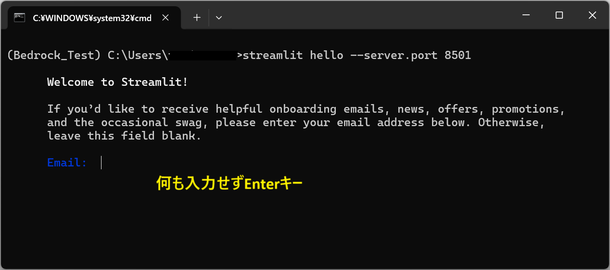

## ■目的
・ローカルAnaconda環境で`LangChain`と`Streamlit`を使い、チャット形式のアプリを作成する  
・書籍「Amazon Bedrock生成AIアプリ開発入門」の内容を、Cloud 9を使用せずに行う(ローカルのAnacondaで実行)  

---

## ■環境
|項目|説明|
|---|---|
|Bedrockのモデル|Anthropic Claude 3 Sonnet|
|AWSリージョン|バージニア北部|
|環境|Anaconda(ローカルPC)|
|Pythonバージョン|3.11|
|Pythonライブラリ|・boto3<br>・langchain<br>・langchain-aws・langchain-community<br>・streamlit<br>・python-deteutil|
|その他AWSサービス|Dynamo DB|

※Anacondaとboto3の準備ができていない場合は、前のハンズオン手順を確認してインストールする  

---

## 準備

(1)Anacondaを起動し、「Environment」の「Bedrock_Test」の「▶」 をクリックし、「Open with JupyterNotebook」をクリックする
  

---

(2)Jypyter Notebookで以下を実行し、各種ライブラリをインストールする  
```
pip install langchain langchain-aws langchain-community streamlit python-dateutil
```

---

## １．LangChainの実装
・まず、LangChainのみで生成AIに問い合わせする

**LangChainでテキスト出力**  
(1)Jypyter Notebook上でインストールしても次回はリセットされるため、まず「**準備**」を行う  

---

(2)Jypyter Notebookのセルに以下を入力し、実行する  
```
# Python外部モジュールのインポート
from langchain_aws import ChatBedrock
from langchain_core.messages import HumanMessage, SystemMessage

# ChatBedrockを生成
chat = ChatBedrock(
    model_id="anthropic.claude-3-sonnet-20240229-v1:0",
    model_kwargs={"max_tokens": 1000},
)

# メッセージを定義
messages = [
    SystemMessage(content="あなたのタスクはユーザーの質問に明確に答えることです。"),
    HumanMessage(content="空が青いのはなぜですか？"),
]

# モデル呼び出し
response = chat.invoke(messages)

print(response.content)
```

**プログラム概要**  
・LangChainに「Chatedrock」というクラスがあるので使用する  
・`model_id`：使用するモデルIDを指定し、`model_kwargs`に各種パラメータを渡す  
・messages配列に`SystemMessage(システムプロンプト)`と`HumanMessage(ユーザープロンプト)`を1つずつセットする  
・最後にInvokeメソッドでBedrockを呼び出す  

**出力結果例**  
```
空が青く見える主な理由は、太陽の光が地球の大気中の分子によって散乱されるためです。この現象は「レイリー散乱」と呼ばれています。

具体的には、以下のように説明できます。

- 太陽光は可視光線の連続スペクトルで構成されており、violet(紫外領域に近い青紫色)の短い波長が大気中の分子(主に酸素やごく小さい微粒子)により強く散乱されます。

- 一方、赤色などの長い波長の光は比較的直進性が高いため、あまり散乱されません。

- 結果として、空を見上げるとき、目に入ってくるのは主に散乱された短い波長の青紫色の光になります。

- そのため、我々の眼には空が青く映るのです。

- 日の出や日の入り時は、太陽光が通る大気の距離が長くなるため、赤色が目立って空が赤く見えます。

このレイリー散乱は、美しい青空のみならず、朝焼けや夕焼けの美しい色彩にも関係しています。
```

---

**LangChainでテキストストリーム出力**  
```
# Python外部モジュールのインポート
from langchain_aws import ChatBedrock
from langchain_core.messages import HumanMessage, SystemMessage

# ChatBedrockを生成
chat = ChatBedrock(
    model_id="anthropic.claude-3-sonnet-20240229-v1:0",
    model_kwargs={"max_tokens": 1000},
    streaming=True,
)

# メッセージを定義
messages = [
    SystemMessage(content="あなたのタスクはユーザーの質問に明確に答えることです。"),
    HumanMessage(content="空が青いのはなぜですか？"),
]

# モデル呼び出し
# response = chat.invoke(messages)
#
# print(response.content)

# Stream形式でモデル呼び出し
for chunk in chat.stream(messages):
    print(chunk.content, end="", flush=True)

print("")
```

**プログラム概要**  
・ChatBedrockの引数に`streaming=True,`を追加する  
・invokeメソッドのかわりに`streamメソッド`を使用する  
・streamメソッドの戻り値は、Iterator形式(データのストリームを表現するオブジェクト。forループで呼び出すたびに次の値を返却する)のトークン  
　→受け取ったトークンを改行なしで出力すれば、少しずつ文章を生成しているような動作になる  

**出力結果例**  
※以下が少しずつ出力される  
```
空が青く見える主な理由は、太陽光が地球の大気中の分子によって散乱されるためです。この現象を"レイリー散乱"と呼びます。

具体的には:

- 太陽光は様々な波長の光で構成されていますが、shorter短い波長の光ほど大気中の分子によって強く散乱されます。

- 可視光の中で最も短い波長は青色光なので、青色光が最も強く散乱されます。

- 散乱された青色光が、あらゆる方向から私たちの目に入るので、空全体が青く見えるのです。

- 一方、他の波長の光は地表付近に到達するか、大気圏の外へ散乱されてしまうため、空の色に大きな影響を与えません。

このレイリー散乱が起こるため、快晴の daytimeの空は美しい青色に見えるのです。夕方や朝方は光路が長くなるため、赤い光も目に入るようになり、空が赤っぽく見えます。
```

---

## ２．Streamlitとの統合

(1)Bedrock_Testの「▶」をクリックし、「Open Terminal」をクリックする  
  

---

(2)コマンドプロンプトが起動したら以下を実行する  
```
streamlit hello --server.port 8501
```

---

(3)以下のメッセージで何も入力せずに「Enter」キーを押下する  
  

---

(4)以下のメッセージが表示されたら「許可」をクリックする  
  

---

(5)ブラウザにStreamlitのページが表示される  
接続されるURL  
http://localhost:8501/  

  

---

(6)コマンドプロンプトでCtrlキー + Cキーを押下し、サーバーを停止する  
  

---

### ２－２．Streamlitのチャット画面を実装する  

(1)以下の内容のファイルを「4_streamlit.py」という名前で保存する  
※保存場所：Anacondaのルートフォルダ(`C:\Users\<ユーザー名>`)  

```
# Python外部モジュールのインポート
import streamlit as st
from langchain_aws import ChatBedrock
from langchain_core.messages import HumanMessage, SystemMessage

# タイトル
st.title("Bedrockチャット")

# ChatBedrockを生成
chat = ChatBedrock(
    model_id="anthropic.claude-3-sonnet-20240229-v1:0",
    model_kwargs={"max_tokens": 1000},
    streaming=True,
)

# メッセージを定義
messages = [
    SystemMessage(content="あなたのタスクはユーザーの質問に明確に答えることです。"),
]

# チャット入力欄を定義
if prompt := st.chat_input("何でも聞いてください。"):
    # ユーザーの入力をメッセージに追加
    messages.append(HumanMessage(content=prompt))

    # ユーザーの入力を画面表示
    with st.chat_message("user"):
        st.markdown(prompt)

    # モデルの呼び出しと結果の画面表示
    with st.chat_message("assistant"):
        st.write_stream(chat.stream(messages))
```

**プログラム概要**  
・タイトル：画面上部のタイトルを作成する  
・チャットの入力欄：
・ユーザーの入力：chat_messageの引数でアバターアイコンが変わる  
・モデルの呼び出し結果と画面表示：

チャット入力欄を変数promptで受け取り、それをif文の条件に指定している  
→ユーザーが入力を送信した隊員ぐで変数promptにユーザーの入力した値が代入されて、if文の条件がTrueになる  

---

(2)コマンドプロンプトで以下を実行する  
```
streamlit run 4_streamlit.py --server.port 8501
```

  

---

(9)ブラウザでチャット画面のページ表示される  
  

**チャットの結果例**  
  

**現状の課題**  
現状では、チャット欄にテキストを続けて入力しても、最後の文字列しか送信されない  
→前のやり取りを踏まえた継続的なやり取りができない  

---

### ２－３．カスタマイズしてチャット形式の継続したやり取りに対応する
(1)以下の内容のファイルを「`5_streamlit-session.py`」という名前で保存する  
※保存場所：Anacondaのルートフォルダ(`C:\Users\<ユーザー名>`)  

```
# Python外部モジュールのインポート
import streamlit as st
from langchain_aws import ChatBedrock
from langchain_core.messages import AIMessage, HumanMessage, SystemMessage
# ★AIMessageを追加★

# タイトル
st.title("Bedrockチャット")

# ChatBedrockを生成
chat = ChatBedrock(
    model_id="anthropic.claude-3-sonnet-20240229-v1:0",
    model_kwargs={"max_tokens": 1000},
    streaming=True,
)

# メッセージを定義
# messages = [
#     SystemMessage(content="あなたのタスクはユーザーの質問に明確に答えることです。"),
# ]

# セッションにメッセージを定義
if "messages" not in st.session_state:
    st.session_state.messages = [
        SystemMessage(content="あなたのタスクはユーザーの質問に明確に答えることです。"),
    ]

# メッセージを画面表示
for message in st.session_state.messages:
    if message.type != "system":
        with st.chat_message(message.type):
            st.markdown(message.content)

# チャット入力欄を定義
if prompt := st.chat_input("何でも聞いてください。"):
    # ユーザーの入力をメッセージに追加
    # messages.append(HumanMessage(content=prompt))
    st.session_state.messages.append(HumanMessage(content=prompt))
    
    # ユーザーの入力を画面表示
    with st.chat_message("user"):
        st.markdown(prompt)

    # モデルの呼び出しと結果の画面表示
    with st.chat_message("assistant"):
    #    st.write_stream(chat.stream(messages))
        response = st.write_stream(chat.stream(st.session_state.messages))

    # モデル呼び出し結果をメッセージに追加 ★追加★
    st.session_state.messages.append(AIMessage(content=response))
```

**プログラムカスタマイズの概要**  
・AIMessageをインポートする  
・`st.session_state`を使用すると、イベント発生時にも値の維持が可能になる  
・先ほどのスクリプトの変数messagesを、`st.session_state.messages`に変更する  
・`st.session_state.messages`の値を画面に表示することで、過去のやり取りを再現する。この際に`SystemMessage`を除外するとよりスマート  
・他の変数messagesを使っていた場所も同様に、`st.session_state.messages`を使用するように変更する  
・最後にストリーム出力した最終結果を`AIMessage`として`st.session_state.messages`に追加する  

---

(2)コマンドプロンプトで以下を実行する  
```
streamlit run 5_streamlit-session.py --server.port 8501
```

  

---

**前のやり取りから継続してチャットできる例**
  

---

### ２－４．Dynamo DBを使用してチャット履歴を永続化する
・ブラウザを再読み込みするとst.session_stateの値が初期化されるので、チャット履歴をデータベースに保存して永続化する  
・LangChainには、チャットを永続化できるMemory機能がある  
・今回は、永続化する先としてDynamo DBを使用する  

---

### ２－４－１．DynamoDBテーブルを作成

(1)DynamoDBコンソールを開き、「テーブル」をクリックし、「テーブルの作成」をクリックする  
  

---

(2)
**テーブルの詳細**
・テーブル名：`BedrockChatSessionTable`  
・パーティションキー：`SessionId`  

  

---

**テーブル設定**  
・`設定をカスタマイズ`  
・`DynamoDB標準`  

  

---

**読み込み/書き込みキャパシティの設定**  
・キャパシティーモード：`オンデマンド`  

**セカンダリインデックス**  
・デフォルト  

  

---

**保管時の暗号化**
**削除保護**  
・デフォルト  

  

---

**リソースベースのポリシー**  
・デフォルト  

  

---

**タグ**  
・デフォルト  

  

---

### ２－４－２．IAMユーザーにDynamoDBアクセス許可を付与する
作成済みIAMユーザー`Bedrock-user`に以下の許可ポリシーを追加する  
・`AmazonDynamoDBFullAccess`  

  

---

### ２－４－３．プログラムの作成
・チャット履歴をテーブルに永続化する処理を追加する  

---

(1)以下の内容のファイルを「`6_streamlit-dynamodb.py`」という名前で保存する  
※保存場所：Anacondaのルートフォルダ(`C:\Users\<ユーザー名>`)  

```
# Python外部モジュールのインポート
import streamlit as st
from langchain_aws import ChatBedrock
from langchain_community.chat_message_histories import DynamoDBChatMessageHistory
from langchain_core.messages import HumanMessage
from langchain_core.prompts import ChatPromptTemplate, MessagesPlaceholder

# タイトル
st.title("Bedrockチャット")

# セッションIDを定義
if "session_id" not in st.session_state:
    st.session_state.session_id = "session_id"

# セッションに履歴を定義
if "history" not in st.session_state:
    st.session_state.history = DynamoDBChatMessageHistory(
        table_name="BedrockChatSessionTable", session_id=st.session_state.session_id
    )

# セッションにChainを定義
if "chain" not in st.session_state:
    # プロンプトを生成
    prompt = ChatPromptTemplate.from_messages(
        [
            ("system", "あなたのタスクはユーザーの質問に明確に答えることです。"),
            MessagesPlaceholder(variable_name="messages"),
            MessagesPlaceholder(variable_name="human_message"),
        ]
    )

    # ChatBedrockを生成
    chat = ChatBedrock(
        model_id="anthropic.claude-3-sonnet-20240229-v1:0",
        model_kwargs={"max_tokens": 1000},
        streaming=True,
    )

    # Chainを生成
    chain = prompt | chat
    st.session_state.chain = chain

# 履歴クリアボタンを画面表示
if st.button("履歴クリア"):
    st.session_state.history.clear()

# メッセージを画面表示
for message in st.session_state.history.messages:
    with st.chat_message(message.type):
        st.markdown(message.content)

# チャット入力欄を定義
if prompt := st.chat_input("何でも聞いてください。"):
    with st.chat_message("user"):
        st.markdown(prompt)

    # モデルの呼び出しと結果の画面表示
    with st.chat_message("assistant"):
        response = st.write_stream(
            st.session_state.chain.stream(
                {
                    "messages": st.session_state.history.messages,
                    "human_message": [HumanMessage(content=prompt)],
                },
                config={"configurable": {"session_id": st.session_state.session_id}},
            )
        )

        # 履歴に追加
        st.session_state.history.add_user_message(prompt)
        st.session_state.history.add_ai_message(response)
```

---

(2)コマンドプロンプトで以下を実行する  
```
streamlit run 6_streamlit-dynamodb.py --server.port 8501
```

  

---

**確認**  
  

・「履歴をクリア」ボタン:チャット履歴をクリアする  
・ブラウザをリロードしても履歴が保持される  
