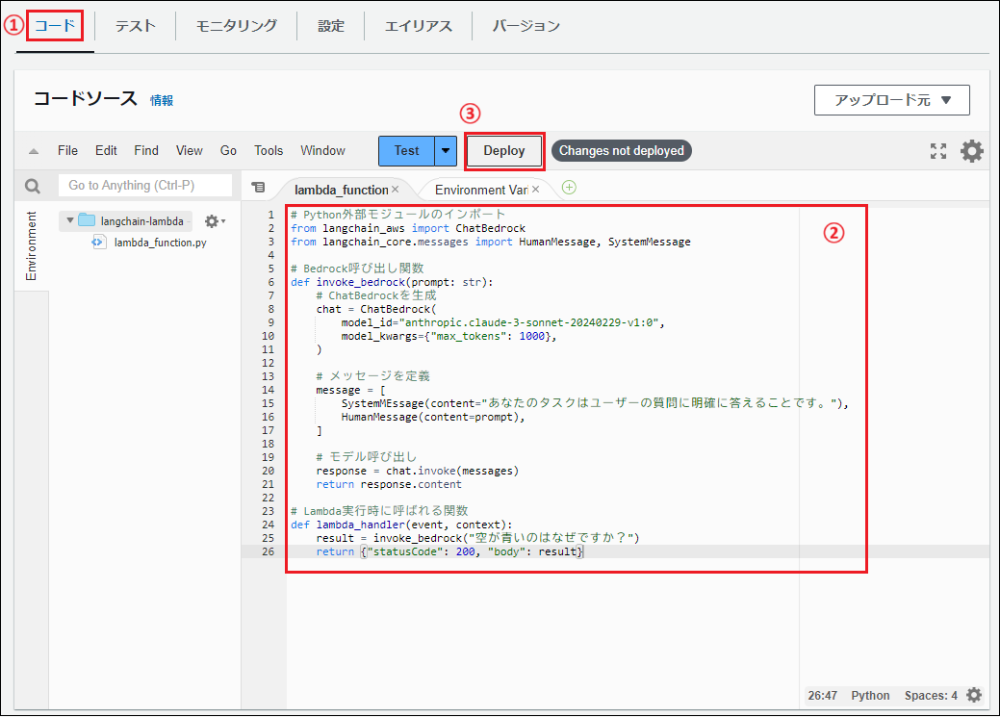

## ■目的
・AWS Lambdaを使った生成AIアプリを作成する  
・書籍「Amazon Bedrock生成AIアプリ開発入門」の「3.6」のハンズオン  

---

## ■環境
|項目|説明|
|---|---|
|Bedrockのモデル|Anthropic Claude 3 Sonnet|
|AWSリージョン|バージニア北部|
|環境|Anaconda(ローカルPC)|
|Pythonバージョン|3.12|
|Pythonライブラリ|Lambdaレイヤー<br>・langchain 0.2.11<br>・langchain-aws 1.15・langchain-community 0.2.11<br>・python-deteutil|
|その他AWSサービス|AWS Lambda|

---

## ■構築内容
LambdaでLangChainを動作させる方法は以下の2つがある  
・`Lambdaレイヤーを使用する`  
・`コンテナイメージを使用する`  

---

## １．Lambdaレイヤーを作成する
・必要なライブラリをまとめてLambdaレイヤーにアップロードする  
・Lambda関数にレイヤーを関連付けることで、ライブラリを使用できる  
・レイヤーは1つあたり50MB未満にする必要がある  
　→5つまで関連付け可能なので、サイズ上限を超える場合は分割する  
　→ARNでも指定できる  
・★Anacondaでやるとエラーが出たのでCloudShellでできるか試す  

 <ご参考>  
バージニア北部リージョンの場合、以下のリストのARNを使用できる  
https://api.klayers.cloud//api/v2/p3.9/layers/latest/us-east-1/html  

---

### ★削除★１－１．IAMユーザーにLambdaアクセス許可を付与する
作成済みIAMユーザーBedrock-userに以下の許可ポリシーを追加する  
・`AWSLambda_FullAccess`  

  

---

### １－２．Lambdaレイヤーを作成
・CloudShellを使う    
・以下の許可ポリシーが設定されているIAMユーザーでCloudShellを起動して実施する    

参考URL
https://qiita.com/yuki_ink/items/62f28d40b726918207c9  
 

---

(1)マネジメントコンソールでCloudShellアイコンをクリックする  

---

(2)エディタで`Dockerfile-langchain-0.2.11`ファイルを作成する  
```
vi Dockerfile-langchain-0.2.11
```

---

(3)以下をコピー&ペーストし、「:wq」で保存する  
```
FROM public.ecr.aws/lambda/python:3.12

WORKDIR /work

# システム更新と必要なパッケージのインストール
RUN dnf update && dnf install -y zip

RUN pip install --upgrade pip && \
    pip install langchain==0.2.11 -t /python/lib/python3.12/site-packages/ && \
    pip install langchain-community==0.2.11 -t /python/lib/python3.12/site-packages/ && \
    pip install langchain-core==0.2.11 -t /python/lib/python3.12/site-packages/ && \
    pip install langchain-aws==0.1.15 -t /python/lib/python3.12/site-packages/

# boto3など、不要なパッケージを削除
RUN rm -rf /python/lib/python3.12/site-packages/boto3* \
           /python/lib/python3.12/site-packages/botocore* \
           /python/lib/python3.12/site-packages/s3transfer* \
           /python/lib/python3.12/site-packages/docutils* \
           /python/lib/python3.12/site-packages/jmespath* \
           /python/lib/python3.12/site-packages/chardet* \
           /python/lib/python3.12/site-packages/six* \
           /python/lib/python3.12/site-packages/python_dateutil*

ENTRYPOINT [""]
CMD zip -r langchain-0.2.11.zip /python/lib/python3.12/site-packages/
```

---

(4)作成したDockrefileを使用してコンテナイメージを作成する  
```
docker build -t langchain-0.2.11 . -f Dockerfile-langchain-0.2.11
```

---

(5)コンテナを実行する(ライブラリをダウンロードしてzip作成)  
```
docker run -v "${PWD}":/work langchain-0.2.11
```

---

(6)zipファイルが作成されていることを確認する  
```
ll
```

**結果例**  
```
[cloudshell-user@ip-10-138-173-30 ~]$ ll
total 51200
-rw-r--r--. 1 cloudshell-user cloudshell-user     1149 Oct 20 11:24 Dockerfile-langchain-0.2.11
-rw-r--r--. 1 root            root            52422046 Oct 20 11:35 langchain-0.2.11.zip
```

---

(7)作成したzipファイルをLambdaレイヤーにアップロードする  
```
aws lambda publish-layer-version \
--layer-name langchain-layer \
--compatible-runtimes python3.12 \
--compatible-architectures x86_64 \
--zip-file fileb://langchain-0.2.11.zip --no-cli-pager
```

---

(7)Lambdaコンソール(バージニア北部リージョン)を確認し、Lambdaレイヤーが作成されていることを確認んする  
  

---

### １－３．Lambda関数を作成する

(1)Lambdaコンソールで「関数」をクリックし、「関数の作成」をクリックする  
  

---

(2)以下を指定し、「関数の作成」をクリックする  
・関数名：`langchain-lambda`  
・ランタイム：`Python 3.12`  
・アーキテクチャ：`x86_64`

  

---

(3)「コード」タブをクリックする  
  

---

(4)画面を下にスクロールし、「レイヤーの追加」をクリックする  
  

---

(5)以下を指定し、「追加」をクリックする  
・レイヤーソース：`カスタムレイヤー`  
・カスタムレイヤー：`langchain-layer`を選択  
・バージョン：<最新のものを選択>  

  

---

(6)「設定」タブの「一般設定」をクリックし、「編集」をクリックする  
  

---

(7)タイムアウトを1分にし、「langchain-lambda-role-xxxxxxロールを表示」をクリックする  
  

---

(8)ブラウザの別タブでIAMロール画面が開くので、「許可を追加」をクリックし、「ポリシーをアタッチ」をクリックする  
  

---

(9)`AmazonBedrockFullAccess`に☑を入れ、「許可を追加」をクリックする  
  

---

(10)ブラウザでLambdaの「基本設定を編集」画面に戻り、「保存」をクリックする  
  

---

(11)「コード」タブをクリックし、以下のコードを入力し、「Deploy」をクリックする    
```
# Python外部モジュールのインポート
# Python外部モジュールのインポート
from langchain_aws import ChatBedrock
from langchain_core.messages import HumanMessage, SystemMessage

# Bedrock呼び出し関数
def invoke_bedrock(prompt: str):
    # ChatBedrockを生成
    chat = ChatBedrock(
        model_id="anthropic.claude-3-sonnet-20240229-v1:0",
        model_kwargs={"max_tokens": 1000},
    )

    # メッセージを定義
    messages = [
        SystemMessage(content="あなたのタスクはユーザーの質問に明確に答えることです。"),
        HumanMessage(content=prompt),
    ]
    
    # モデル呼び出し
    response = chat.invoke(messages)
    return response.content

# Lambda実行時に呼ばれる関数
def lambda_handler(event, context):
    result = invoke_bedrock("空が青いのはなぜですか？")
    return {"statusCode": 200, "body": result}
```

  

---

(12)「正常に更新されました」メッセージが表示されることを確認する  
  

---

(13)「テスト」タブをクリックし、「テスト」をクリックする  
  

---

(14)結果が「成功」になることを確認する  
  

---

## ２．フロントになんか作ってLambdaを実行できるようにする
★どうやるか検討中★  
・Slackから  
・LINEから  

