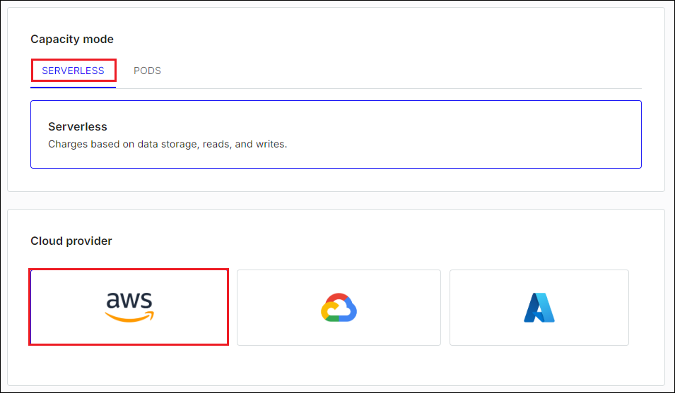
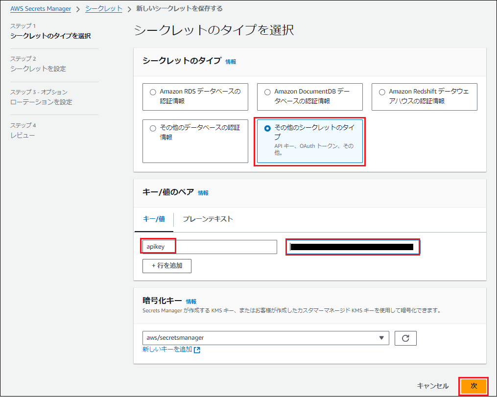
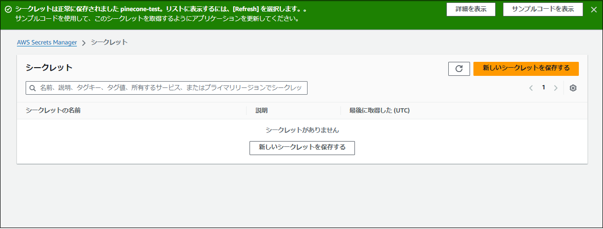
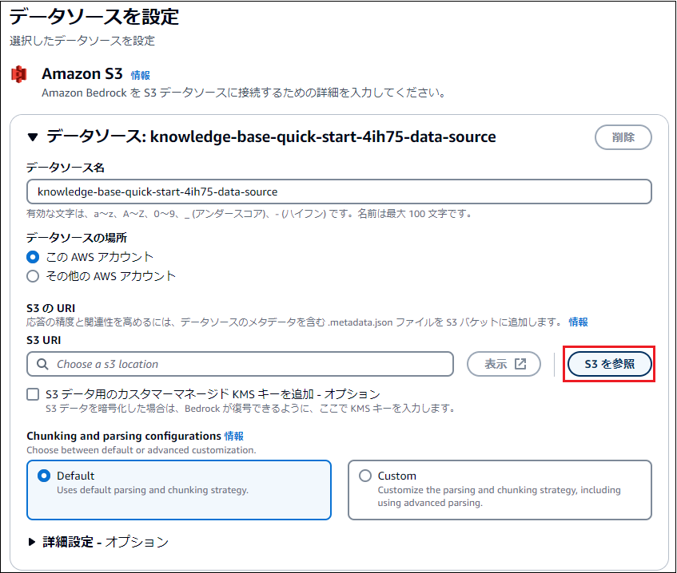

## ■目的
・Knowledge bases for Amazon Bedrockを使用すると、GUI操作だけでRAGを実装し、アプリケーション組み込みためのエンドポイントを用意できる  
・書籍「Amazon Bedrock生成AIアプリ開発入門」の第4章をベースに勧めるが、埋め込みモデルはPineconeを使用する  

※Knowledge bases自体は無料で利用できるが、ナレッジベースから利用したモデルとベクトルDBの利用料金は発生する  

---

## ■概要
０．使用するモデルの利用準備  
１．ソースのS3バケットを作成  
２．ナレッジベースのベクトルデータベースはMarketplaceのPinecone Serverlessを準備する  
３．PineconeのAPIキーをSecrets Managerに登録する  
３．Amazon Bedrockのナレッジベースを作成する  

---

## ０．モデルアクセスのリクエスト
以下の2つが利用可能になっていること  
・`Claude 3 Sonnet`  
・`Embed Multilingual` ★特にこれ★  

ナレッジベースで、ソースのドキュメントをベクトル変換するための埋め込みモデルが必要となる  
今回は埋め込みモデルとして`Embed Multilingual`を使用する  

  

---

## １．S3バケットを作成する  

(1)以下でバケットを作成する  
・リージョン：`バージニア北部`  
・バケット名：`s3-knowledgebases-test-215551027696`  
・その他デフォルト  

  

---

(2)以下のURLに接続し、User Guideのpdfファイル`bedrock-ug.pdf`をローカルに保存する  
https://docs.aws.amazon.com/ja_jp/bedrock/  

---

(3)作成したS3バケットに`bedrock-ug.pdf`をアップロードする  
  

---

## ２．Pineconeでベクトルデータベースを作成
・ベクトルデータベースをクイック作成するとOpenSearch Severlessで作成されるが高い！  
・安価にすませるため、MarketplaceのPineconeを使う  

**参考URL**  
https://aws.amazon.com/jp/blogs/news/leveraging-pinecone-on-aws-marketplace-as-a-knowledge-base-for-amazon-bedrock/  

---

### ２－１．AWSのMarkerplaceのPinecone Serverlessをセットアップする  

(1)マネジメントコンソールでMarketplaceを開き、「製品を検出」をクリックする  
  

---

(2)「`pinecone`」で検索し、検索結果の`Pinecone Vector Database - Pay As You Go Pricing`をクリックする  
  

---

(3)ブラウザの別タブで開くPineconeページの「View purchase options」をクリックする  
  

---

(4)画面を下にスクロールし、「Subscribe」をクリックする  
  

※5分程度待つと完了する  
  

---

(5)画面を上にスクロールし、「Set up your account」をクリックする  
  

---

(6)ブラウザの別タブにPineconeのサイトが起動する。今回は「Continue with Google」をクリックする  
  

---

(7)使用するアカウントを選択  
  

---

(8)内容を確認して「次へ」をクリックする  
  

---

(9)「Connect AWS to Pinecone in seconds」画面の「Select an organization」で選択し、「Connect to Pinecone」をクリックする  
  

---

(10)「Connect」をクリックする  
  

---

(11)以下を指定して「Continue」をクリックする  
・First NameとLast Nameはデフォルトで入力されている  
・Purpose of use：`Personal`に変更  
・Preferred coding language：<任意>  

  

---

(12)Pineconeの用途と利用ドキュメント数の想定を選択し、「Continue」をクリックする  
※今回は以下とする  
・Q&A Chat  
・Less than 100k  

  

---

(13)埋め込みモデルがあるかを選択し、「Let's Get Started」をクリックする  
※今回は「I'm new to vector embeddings」を選択する  
  

---

### ２－２．Pineconeの設定  
・indexを作成する  
・API Keyを確認する  

(1)「Database」の「Indexes」をクリックする  
  

---

(2)Create a new index画面で以下を指定し、「Create index」をクリックする  
・Default / `pinecone-test-index`  
・Dimensionsは、使用する埋め込みモデルに合わせて以下を指定する  
※今回は「`Cohere Embed Multilingual`」にするので`1024`にする  

|埋め込みモデル|ディメンション|
|---|---|
|Titan G1 Embedding - text|1536|
|Titan V2 Embedding - text|1024|
|Cohere Embed English|1024|
|Cohere Embed Multilingual|1024|

https://docs.aws.amazon.com/ja_jp/bedrock/latest/userguide/knowledge-base-setup.html  

  

---

・Capacity mode：`SERVERLESS`  
・Cloud provider：`aws`  
・Region：`Virginia us-east-1`  

  
  

---

(3)インデックスが作成されると表示される画面の「HOST」の値をコピーする  
※HOSTはナレッジベース作成時に入力する  

  

---

### ２－３．Pinecone API Key を AWS Secrets Manager へ登録する

(1)「API Keys」をクリックし、defaultキーのクリップボードアイコンをクリックし、コピーした値を保管しておく  
  

---

(2)マネジメントコンソールでSecrets Managerコンソールを開き、「新しいシークレットを保存する」をクリックする  
  

---

(3)以下を指定し、「次」をクリックする  
・シークレットのタイプ：`その他シークレットのタイプ`  
・キー：`apiKey` **大文字小文字区別あり。Kは大文字**  
・値：<PineconeからコピーしたAPIキー>  

  

---

(4)以下を指定し、「次」をクリックする  
・シークレットの名前：`pinecone-test`  

  
  

---

(5)ローテーションの設定は変更せずに「次」をクリックする  
  

---

(6)レビュー画面で内容を確認し、「保存」をクリックする  
  

---

(8)更新ボタンをクリックし、作成したシークレットをクリックする  
  
  

---

(9)シークレットのARNをメモする  
※ナレッジベース作成時に入力する  

  

---

## ３．ナレッジベースを作成する  

(1)Bedrockコンソールのメニューから「ナレッジベース」をクリックし、「ナレッジベースを作成」をクリックする  
  

---

(2)ステップ1：デフォルトで「次へ」をクリックする  

  
  
  

---

(3)ステップ2-1：「S3を参照」をクリックする  
  

---

(4)ステップ2-2：作成した「`s3-knowledgebases-test-215551027696`」を選択し、「選択」をクリックする  
  

---

(5)ステップ2-3：「次へ」をクリックする  
  

---

(6)ステップ3：以下を指定して「次へ」をクリックする  
・埋め込みモデル：`Embed Multilingual v3(Cohere)`  
・ベクトルデータベース：`作成したベクトルストアを選択`  
　→ `Pinecone`を選択  
　→ `☑` Pineconeを選択することにより、お客様は、....  
・エンドポイントURL：`PineconeのエンドポイントURL`  
・認証情報シークレットARN：`Secrets ManagerのシークレットのARN`  
・テキストフィールド名：`text`  
・Bedrockマネージドメタデータフィールド名：`metadata`  
  
  
  

**※「新しいベクトルストアをクイック作成」にする場合、OpenSearch Serverlessのコレクションが自動生成される。1日5ドル以上かかる**  

---

(7)ステップ4：内容を確認して「ナレッジベースを作成」をクリックする  
・完了まで数分かかる  
・画面を閉じずに次の手順に進む  

  

---

(8)ナレッジベースが作成されると、上部に以下が表示される。画面を下にスクロールするか「データソースに移動」をクリックする  
  

---

(9)「データソース」で、今回指定したデータソース(S3バケット名)をクリックする  
  

---

(10)「同期」をクリックする  
  

---

(11)同期が完了することを確認する  
  

---

## ３．ナレッジベース単体での動作を確認する

(1)Amazon Bedrockコンソールの「ナレッジベース」をクリックし、作成したナレッジベースをクリックする  
  

---

(2)「モデルを選択」をクリックする  
  

---

(3)AnthropicのClaude 3 Sonnetを選択し、「適用」をクリックする  
  

---

(4)以下の質問を入力し、「実行」をクリックする  
```
Takeshi TaniguchiのAWS認定セキュリティ専門知識のスコアは？
わからない場合は、「わかりません」と回答してください。
```

  

※世界的にリクエストが多いと以下のエラーになる場合がある  
　安定して回答を得るには`プロビジョンドスループット`を購入する  

  


---

## ４．フロントエンドを実装する
・ローカルのAnaconda環境から実行する  

---

(1)作成済みナレッジベースを開き、ナレッジベースIDをコピーする  
  

---

(2)Anaconda実行環境のホームパスに以下のコードを記述したファイル`1_rag.py`を作成する  

```
# 外部ライブラリをインポート
import streamlit as st
from langchain_aws import ChatBedrock
from langchain_aws.retrievers import AmazonKnoledgeBasesRetriever
from langchain_core.output_parsers imort StrOutputParser
from langchain_core.prompts import ChatPromptTemplate
from langchain_core.runnables import RunnablePassthrough

# 検索手段を指定
retriever = AmazonKnowledgeBasesRetriever(
    knowledge_base_id=xxxxxxxxxx", " ★ここにナレッジベースIDを記載する★
        retriebal_config={"vectorSearchConfiguration":{"numberOfResults": 10}},
)

# プロンプトのテンプレートを定義
prompt = ChatPromptTemplate.from_template(
    "以下のcontextに基づいて回答してください: {context} / 質問： {question}"
)

# LLMを指定
model = ChatBedrock(
    model_id="anthropic.claude-3-sonnet-20240229-v1:0",
    model_kwargs={"max_tokens": 1000},
)

# チェーンを定義(検索 → プロンプト作成 → LLM呼び出し → 結果を取得)
chain = (
    {"context": retriever, "question": RunnablePassthrough())}
    | prompt
    | model
    | StrOutputParser()
)

# フロントエンドを記述
st.title("おしえて！Bedrock")
question = st.text_input("質問を入力")
button = st.button("質問する")

# ボタンが押されたらチェーン実行結果を表示
if button:
    st.write(chain.invoke(question))
```

---

## ５．RAGアプリケーションを実行する

(1)
```
pip install ^
boto3==1.34.87 ^
langchain==0.2.0 ^
langchain-aws==0.1.4 ^
langchain-community==0.2.0 ^
streamlit==1.33.0 ^
python-dateutil==2.8.2
```

---

(2)StreamlitでPythonファイルを実行する  
```
streamlit run 1_rag.py --server.port 8080
```

---
